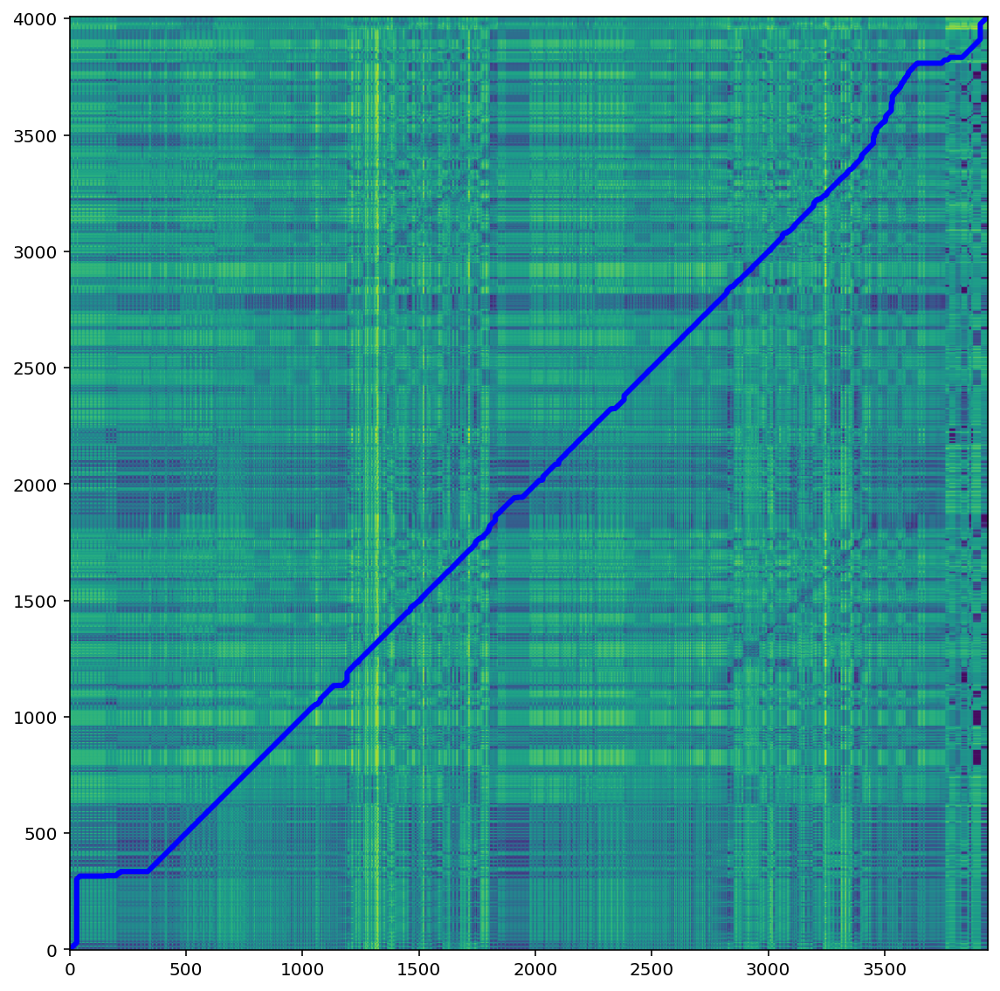
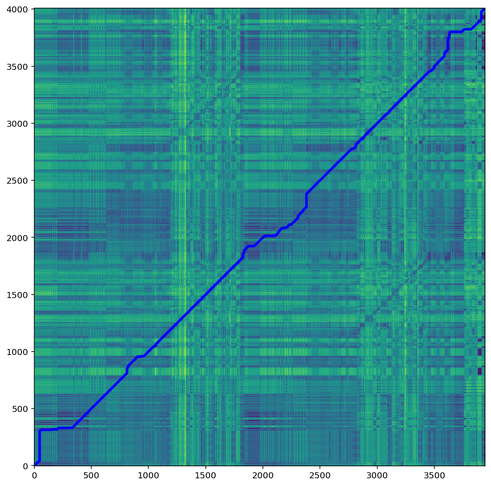

# ScoreFollower

## Preprocessing / Offline

- TLDR;
    - Wrote a the function that exctracts the reference chroma vectors from either a xml score or a wav file. 

- The function **getReferenceChromas** exists in the script utils.py:
    ```python
    def getReferenceChromas(filePath, sr = 44100, n_fft = 4096, 
                            hop_length = 2048, chromaType = "cqt"):
    ```
- We can choose the resolution of the chroma vectors (n_fft, hop_length) as well as the spectrogram type ("cqt" or "stft")
- Experiment
    - Offline global DTW alignment between score chroma vectors and wav chroma vectors
        - score vs stft --> 78
        - score vs cqt  --> 63
        - 
        - 
    - Chroma vectors extracted from cqt spectrum match better to the chromas from the xml score.

## Online

- TLDR; 
    - Implemented the basic 3 modules
        - Audio Recorder (100%)
        - Chroma Extractor (100%)
        - Online DTW (50%)
    - Wrote a basic real time app that uses these modules. 
- The module **Audio Recorder** exists in the script AudioRecorder.py:
    - Accepts input from a specified audio stream. This can be either the microphone, or a wav file (for testing only)
    - Maintains an internal buffer to implement overlap between audio windows. 
    - Sends each frame to the Chroma Extractor module.
- The module **Chroma Extractor** exists in the script Chromatizer.py:


## App Packaging 

- TLDR; 
    - We have excecutable files for each OS (Windows, Mac, Linux)
- Refactored the project's code in order to use a tool called **fbs** 
- **fbs** help us create cross plattform excecutable files for **PyQt5** based python apps
- Disadvantage : Exe files can become very large (i.e >1GB), depending on what python libraries we need